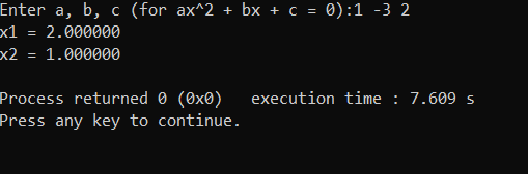
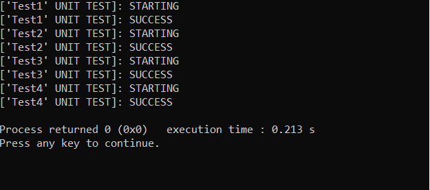

 # Решение квадратного уравнения 
 Данная программа решает квадратное уравнение вида `ax^2 + bx + c = 0` и выводит на экран корни данного уравнение или показывает, что корней нет.
 ## Тестирование
 Программа имеет встроенную систему тестирования, которая проверяет корректность ввода и правильность решения квадратного уравнения.
 Тестирование будет запущена, если будет определен `TEST`
 ## Сборка
 Для сборки можно использовать `CodeBlock IDE` с компилятором g++.
 ## Документация
 Документацию файла можно создать самому с помощью приложения `doxygen`.
 ## Примеры использования программы
 Программа решает квадратное уравнение
 
 
 
 Программа выполняет тестирование
 
 
